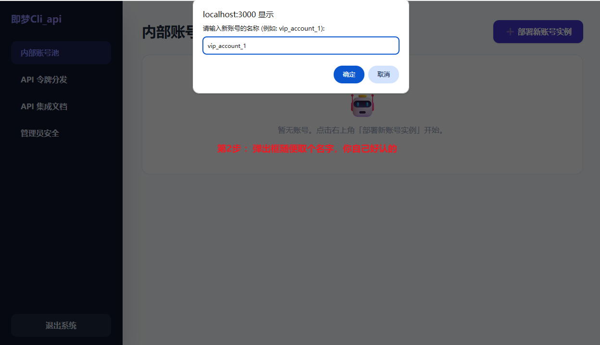
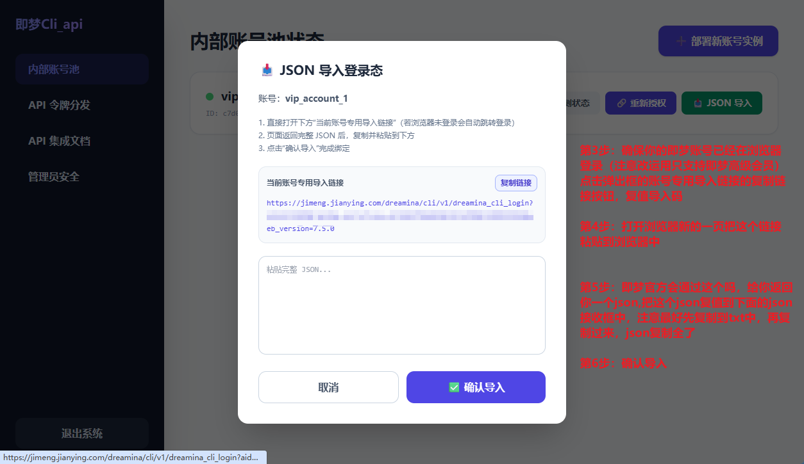
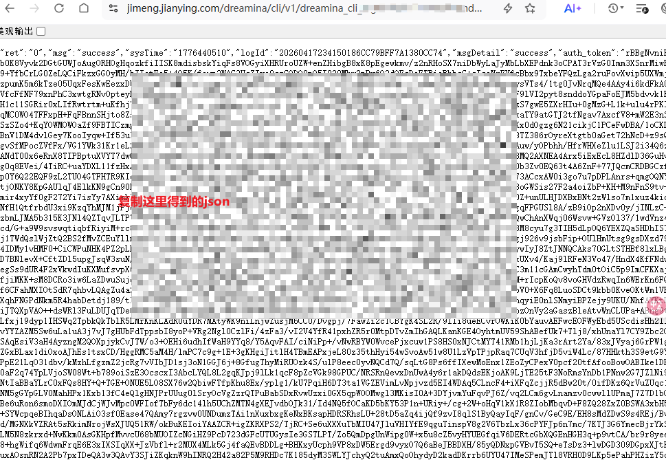
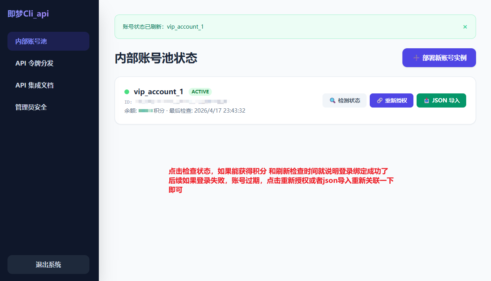
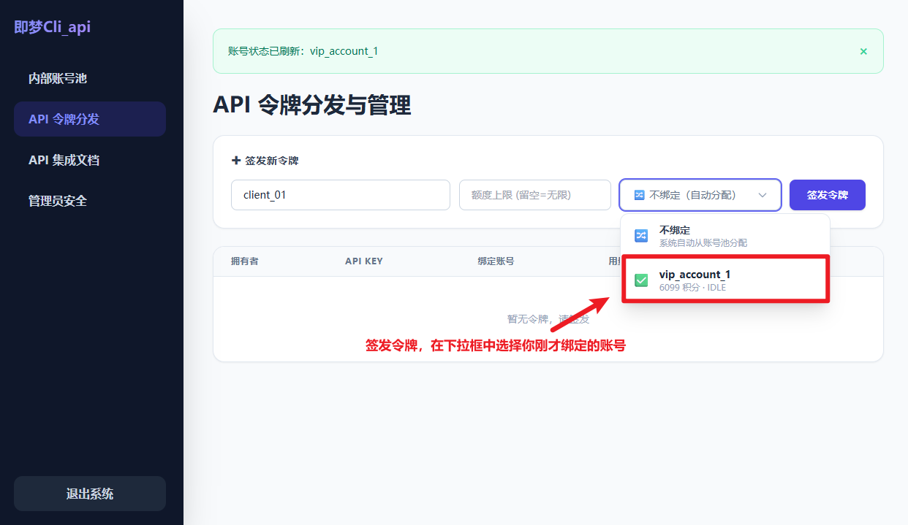
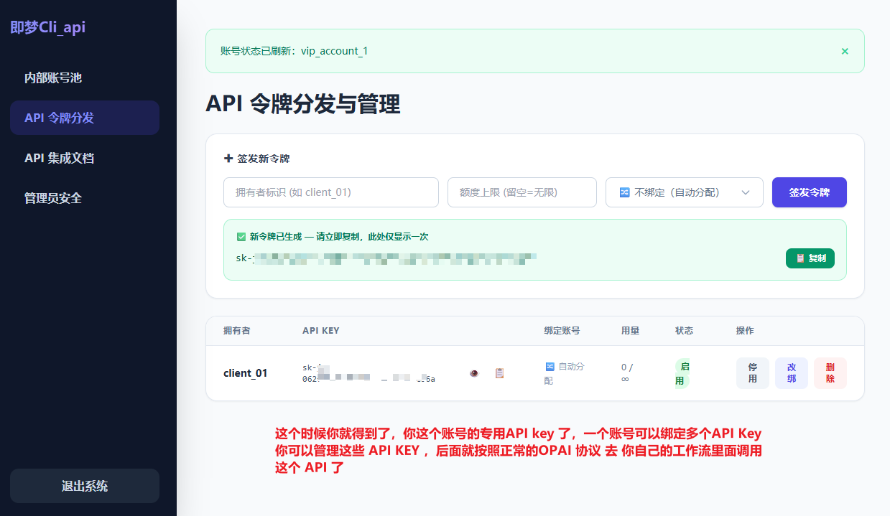
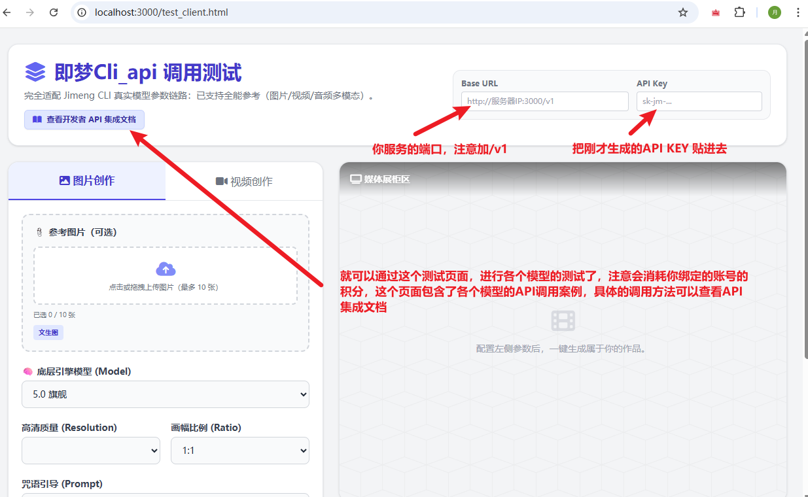

# 即梦Cli_api - 后台管理使用手册

欢迎使用 即梦Cli_api 管理后台！本手册将手把手带你完成系统中最核心的配置，让你的 API 顺利运转。

本手册分为以下几个部分：
1. **内部账号池配置（即刻绑定你的即梦账号）**
2. **API 令牌分发（生成你的专属调用 Key）**
3. **运行监控与失败预检（减少排队后失败）**
4. **API 调用测试（一键验证你的服务）**

---

## 1. 内部账号池配置 (核心第一步)

由于底层调用的限制，你必须先在系统中绑定一个有效的**即梦 VIP 账号**，系统才能替你执行生成任务。请严格按照以下步骤进行：

### 📌 绑定图文步骤：

**第一步：部署新实例**
进入左侧菜单的「内部账号池」，点击右上角的 **`+ 部署新账号实例`** 按钮。

**第二步：给账号起名**
在弹出的对话框中，随便取一个你自己好认的名称（例如：`vip_account_1`），点击确定。

**第三步：获取专属 Auth 链接**
接着系统会弹出「JSON 导入登录态」窗口。
*⚠️ 注意：在此之前，请确保你当前使用的浏览器已经正常登录了即梦官方网页版（并且该账号具有即梦高级会员 VIP 资格）。*
点击该弹窗中的 **`复制链接`** 按钮，获取该账号实例专用的导入链接。

**第四步：在浏览器中打开链接**
在浏览器中打开一个**新的标签页**，把刚刚复制的链接粘贴进去并敲回车访问。

**第五步：提取官方 JSON 代码**
页面会加载出一段由即梦官方返回的很长很长的文本（JSON 格式，满屏代码）。
**请将该页面里的内容从头到尾“全选”并复制**。
*(💡 避坑小贴士：因为内容很长，为了防止复制漏掉括号，建议先 Ctrl+A 复制后粘贴到一个空白的 TXT 记事本里，确认完全复制了，再进行下一步。)*

**第六步：确认导入**
回到我们的管理后台，把刚才复制的完整 JSON 代码，粘贴到弹窗里面的大文本框中，点击 **`确认导入`**。

**第七步：绑定成功状态自检**
导入完成后，刚刚创建的账号会出现在列表中，状态变为绿色的 `ACTIVE`。
**点击账号右侧的 `🔍 检测状态` 按钮**：
如果页面显示获取到了“积分余额”，且“最后检查时间”更新为了当前时间，**恭喜你，你的即梦账号已经完美注入到系统中了！**

> 🛑 **【极度重要：安全与免责声明】** 🛑
> - **绝对不要泄露凭证：** 你刚才复制的 **“专属 Auth 链接”** 和满屏的 **“JSON 代码文档”**，等同于你即梦 VIP 账号的最高登录权限！**一旦发给别人、截图泄露或上传到公开网盘，任何人都能直接登录并盗用你的账号！**
> - **认准官方源码：** 如果你部署的不是从我的官方仓库拿到的纯净源代码，而是别人二次修改打包过的版本，**请务必自行审查代码**。当心别人留后门偷偷将你的 JSON 登录态发送到外部服务器，导致你的账号被恶意盗刷！
> - **免责声明：** 任何因用户自身泄露 JSON 登录代码、或者错误使用携带病毒/后门的第三方非官方开源程序，最终导致账号被盗刷、封禁或产生经济损失的，**本项目及作者概不负责，请自行承担风险！**

---

### ❓ 常见问题
*   **账号过期了怎么办？** 
    如果你过了一段时间发现报错或者账号变成离线，只需要在这点击 `重新授权` 或者 `JSON 导入`，重复一下刚才复制提取的步骤，就能立刻让账号满血复活。

---

## 2. API 令牌分发（生成你的专属调用 Key）

账号池配置好以后，系统就拥有了做图/做视频的“算力”。接下来，你需要给你自己（或你的应用）发一张“通行证”，也就是 **API Key**。

### 📌 签发步骤：

**1. 填写标识并绑定账号**
进入左侧菜单的「API 令牌分发」。在“签发新令牌”区域：
* 填写一个**拥有者标识**（例如：`client_01`）。
* 额度上限你可以留空（代表无限制）。
* **最重要的一步**：在下拉框中，**选择你刚才在第一步绑定成功的内部账号**（例如 `vip_account_1`）。

**2. 生成并复制 API Key**
点击紫色的 **`签发令牌`** 按钮。系统会提示“新令牌已生成”。
*这个时候你就得到了该账号专用的 API Key 了！* **请务必立刻点击“复制”按钮把它保存下来**，因为出于安全考虑，离开页面后这个 Key 将无法再次完整显示。

💡 *提示：一个内部即梦账号可以绑定多个 API Key。你可以通过下方的列表随时管理、停用或删除这些密钥。以后你就可以按照标准的 OpenAI 协议，在任何工作流/第三方 UI 中配置并调用这个 API 了！*

---

## 3. 运行监控与失败预检

管理后台左侧的「运行监控」会统计账号状态、任务产量、失败率、失败提示词、失败模型和最近失败任务。这里的数据用于判断账号池是否健康，以及哪些提示词最容易浪费排队时间。

左侧「失败预检」可以在正式提交前粘贴提示词，系统会根据历史失败任务做相似度检查。该检查不会调用即梦 CLI，也不会消耗积分；如果命中高风险记录，建议先改写提示词、调整模型或换任务类型，再进入正式生成队列。

「任务管理」支持按状态、账号、提示词和失败原因筛选，也可以查看 submit_id、logid、失败原因和结果 URL。卡住的任务可以手动标记失败；已经失败且有 submit_id 的任务可以重置为 PROCESSING，让轮询守护进程重新拉取结果。

---

## 4. API 调用测试（一键验证你的服务）

有了 API Key，我们赶紧去测试一下服务是否全部打通吧！

### 📌 测试步骤：

在你运行本项目的终端窗口，或者浏览器新标签页，打开测试页地址（默认通常是：`http://127.0.0.1:3000/test_client.html` 或者是对应的服务器 IP 页面）。

**1. 填写请求配置**
在界面右上角找到基础配置区域：
* **Base URL**：填写你服务器的端口地址，**注意结尾一定要加 `/v1`** (例如：`http://你的服务器IP:3000/v1`)。
* **API Key**：把你刚刚在第 2 步生成的 `sk-jm-...` 完整地粘贴进去。

**2. 尽情测试**
配置好左侧的模型参数后，你就可以直接在这个网页上进行各类模型（文生图、图生视频等）的调用测试了。
*⚠️ 注意：你的每一次测试成功，都会实际消耗你所绑定的即梦官方账号内的积分余额。具体的 API 调用协议和 JSON 格式，可以随时点击页面左上角的 **`查看开发者 API 集成文档`** 进行深入阅读。*

---
> 🎉 **至此，系统的核心配置已全部跑通，享受即梦Cli_api带来的高效率创作吧！**
